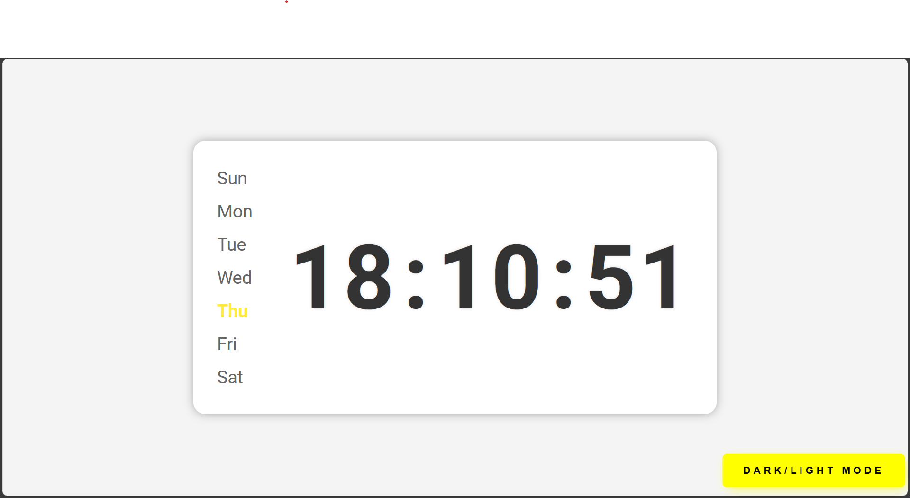
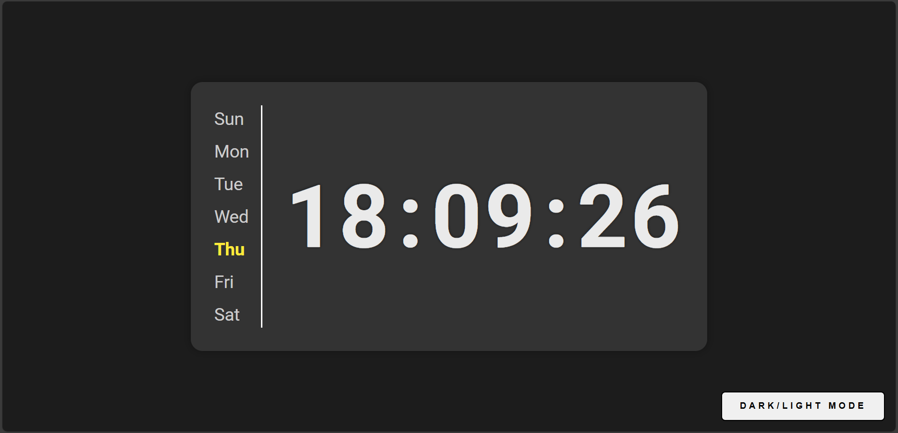

# Digital Clock - A Stylish & Interactive Clock ⌚

My **Digital Clock** is a modern and stylish digital clock that displays the current time and highlights the active day of the week. It features a sleek UI with smooth animations, a dark/light mode toggle, and a responsive design for an enhanced user experience.

---

## 🌟 Key Features

✅ **Live Digital Clock** – Displays real-time hours, minutes, and seconds.  
✅ **Weekday Highlighter** – Dynamically highlights the current day.  
✅ **Dark/Light Mode Toggle** – Switch between dark and light themes with a stylish transition.  
✅ **Smooth Animations** – Elegant hover effects and transitions for an appealing look.  
✅ **Responsive Design** – Optimized for both desktop and mobile screens.  

---

## 🛠 Tech Stack & Functionalities

### **🖥 Frontend:**
- **HTML**: Provides the structure for the clock and theme toggle button.
- **CSS**: Creates a modern, stylish UI with hover effects, transitions, and responsiveness.
- **JavaScript**: Handles real-time clock updates and theme switching.

### **⏳ Functionality:**
- Updates the time every second using `setInterval()`.
- Highlights the active day of the week dynamically.
- Implements a dark/light mode switch with smooth transitions.

---

## 🚀 How It Works

1️⃣ The clock dynamically updates every second.  
2️⃣ The current day is highlighted automatically.  
3️⃣ Clicking the theme toggle button switches between dark and light modes.  

---

## 📸 Screenshots

### **Light Mode:**

### **Dark Mode:**

---

This project provides an elegant and interactive way to check the time while enhancing the UI experience with animations and custom styling. 🎨✨

Happy Coding! 🚀

